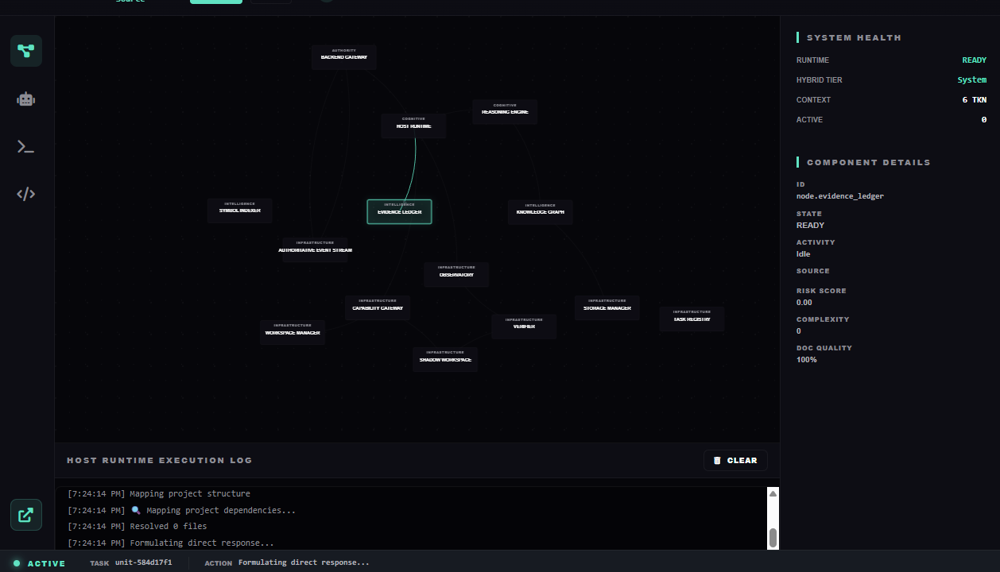

# AEOWUN

### Autonomous Software Engineering Runtime

AEOWUN is the main system I'm building.

It is not an IDE or a chatbot wrapper. It is a runtime for managing software-engineering work around local AI.

The runtime owns the project state, workspace, tools, execution loop, and verification. The model provides reasoning inside that system.

Some prominent features:

- **Causal Blackboard** — shared runtime state with explicit authority over execution-critical information.
- **ShadowFS** — isolated workspace and filesystem state tracking.
- **Foreman** — watches execution and stops repetitive, non-progressing behavior.
- **Steel Thread Analyzer** — traces failures back through the project to help locate the actual source of a problem.
- **Verification** — checks the resulting state instead of treating a successful model/tool response as proof.

---

### Technical Deep-Dives

- [System Architecture](./docs/ARCHITECTURE.md)
- [Engine Capabilities](./docs/FEATURES.md)
- [Verification Rigor](./docs/VERIFICATION.md)

---
Note: This repository is a technical showcase for architectural review. The core source code is proprietary and private.
