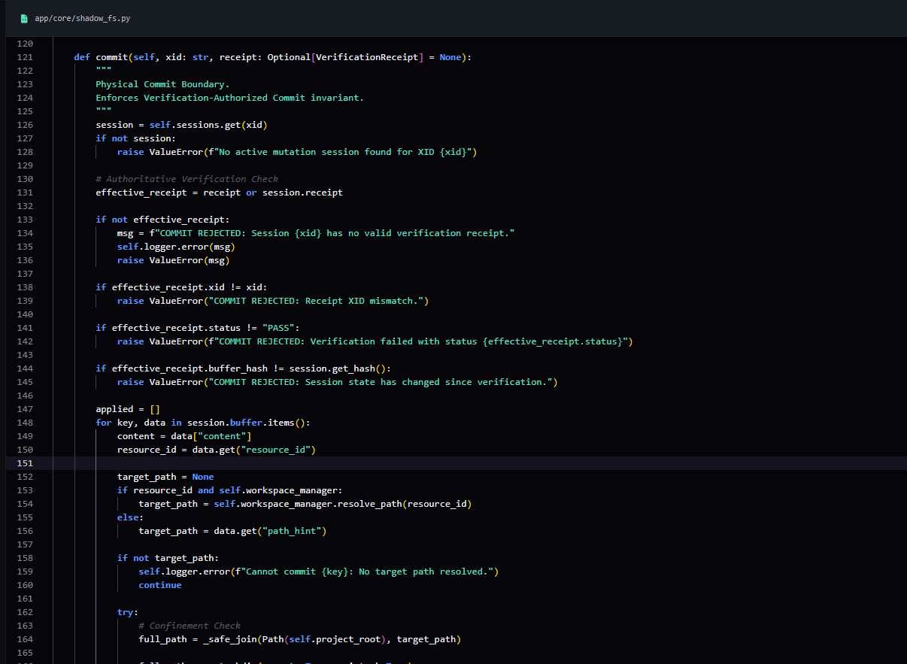

# AEOWUN Architecture // Deterministic Cognitive Mesh

The AEOWUN architecture is designed to transition AI engineering from stochastic generation to a systematically validated execution model.

## Cognitive State Management

The system manages distributed agent cognition through a centralized authority layer.

### Concurrent Causal Blackboard (CCB)
The CCB acts as the thread-safe, co-observed state store for the mesh. It implements the following logic:
- Identity-Based Roles: Roles are strictly ranked (SYSTEM, TRUTH_WITNESS, WATCHDOG, AGENT). High-priority nodes (Physical Reality) cannot be overwritten by lower-ranked agent beliefs.
- Witness Conflict Detection: Triggers immediate conflict events when the physical filesystem state contradicts the current agent intent.
- Causal Versioning: Every state change is timestamped and versioned to maintain an immutable forensic trace of the system's decision-making process.

## Physical Substrate Remediation

AEOWUN implements isolation layers to safely manage autonomous modifications to physical codebases.

### ShadowFS
ShadowFS is a task-isolated virtual filesystem substrate.
- Mutation Sessions: Each task operates in an isolated buffer (XID session), preventing cross-task state corruption.
- Staging Invariants: Files are staged in memory and never touch the physical disk during the reasoning phase.

### Verification-Authorized Commit
The transition from memory to disk is a formal security gate.
- Integrity Validation: The Verifier performs AST signature comparison to ensure proposed edits do not violate architectural invariants.
- Hash Check: Finalizes commits only if the buffer hash matches the validated state, ensuring no tampering occurred between verification and execution.
